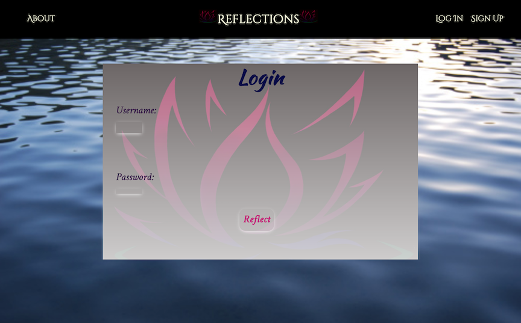

# Reflections

## Background and Conceptualizing
Roughly seven years ago, a mentor of mine shared a recording of a commencement speech with me: ["This is Water" -David Foster Wallace.](https://www.youtube.com/watch?v=8CrOL-ydFMI) Understanding that I was in a difficult place, his goal in sharing this speech with me was simply to plant a seed of the possibility to think and view things differently. When I think back to that point in time, I can remember that this moment itself was significant; the scope of that significance however, is limited. 

As I began brainstorming ideas for this project, I came across that exact same speech. Almost immediately, I started to remember the speech and that moment when I had listened to it for the first time. Although I couldn'nt remember the impact that this speech had on me from 7 years prior, I knew that the impact it had in the present was vastly different. It was from this experience, that the concept for Reflections started to develop. 

Two of the most powerful tools for self-growth are journaling and self-reflection. Though it's hard to imagine something being easier than writing words on a piece of paper, Reflections goes beyond that in that the reusability is much greater. Instead of having to filter through books upon books, and pages upon pages to find my thoughts from a moment that occured 7 years ago, I can find and access that moment just as easy as one from yesterday with Reflections. Reflections stores self-documentation based on moments themselves and allows individuals to revisit those moments as well as contribute additional thoughts. 

Start writing your [Reflections:](https://memory-reflections.herokuapp.com/)

### Website Logo

One of the first things I chose to develop for this project was a custom logo. This was a significant addition to this project as it added a piece of personalization. It also provided a good lesson in deciding where to use a logo throughout an application. 

### Technologies Used 
- Python 
- Django
- JS
- J-Query
- CSS
- HTML
- MC Datepicker

### Attributions
- Google Fonts 
- MC Date Picker 

### Future Plans / Icebox
- Create a fully mobile friendly version 
- Build out the user model so that user's can have distinct profiles / accounts 
- Give users the ability to make their memories public or private 
- Add a discussion / comments model so that users can communicate with one another
- Give users the option to upload photos with their posts
- Build out features for users to sort their reflections (date, type etc.)

